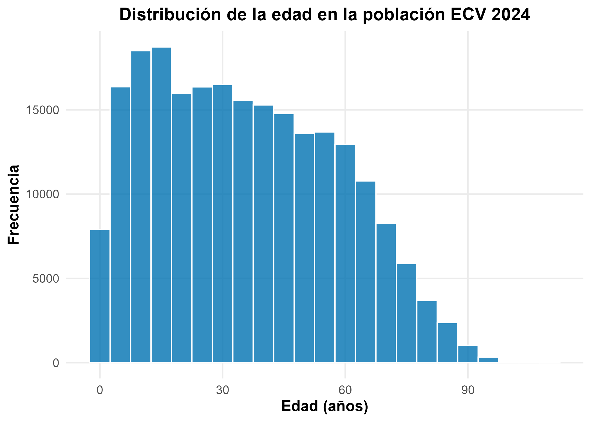
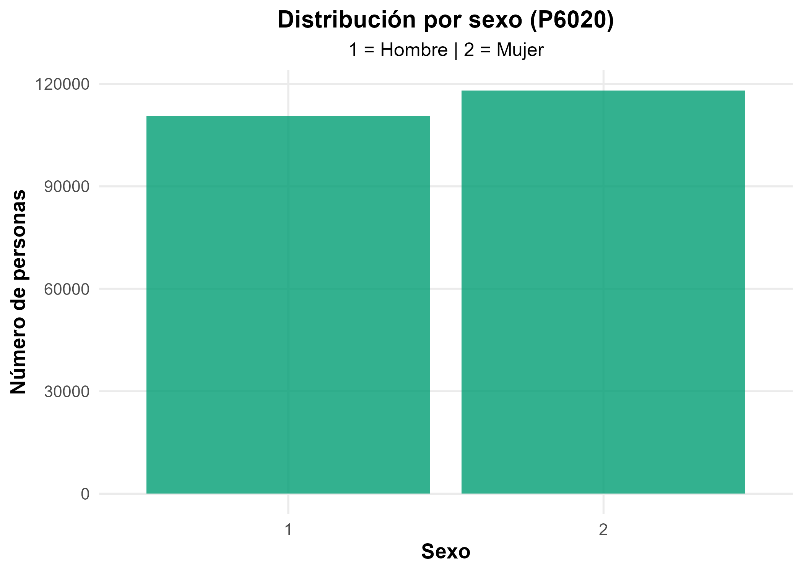
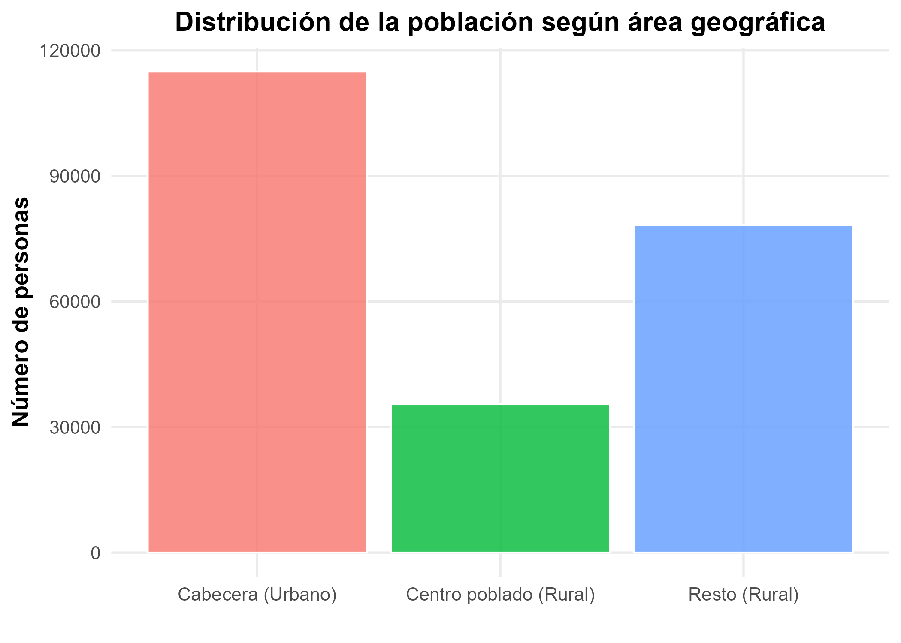
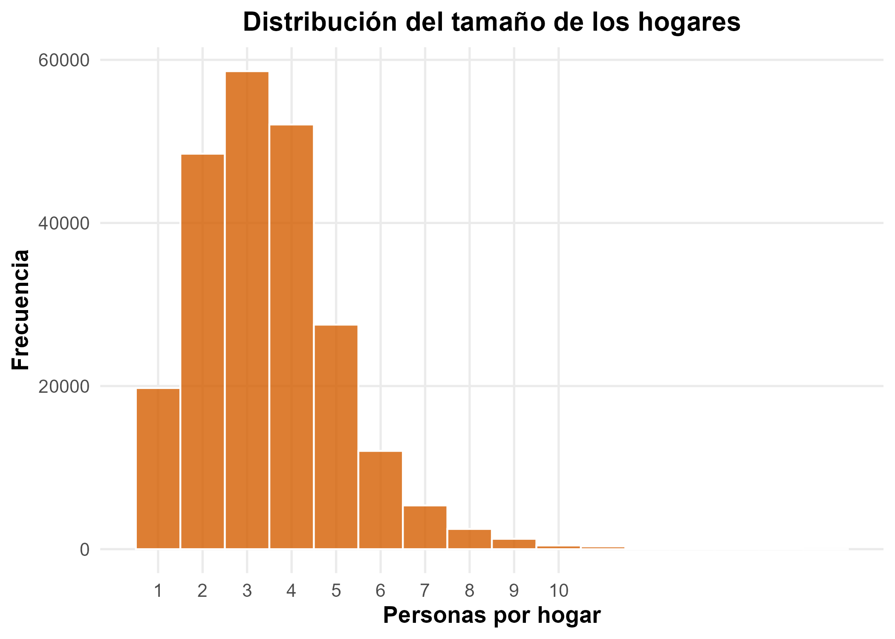
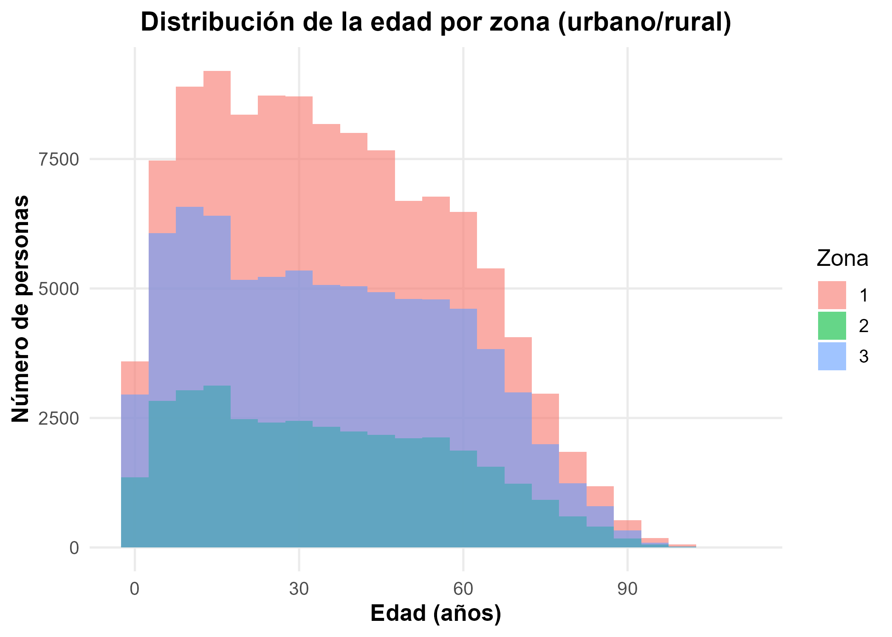
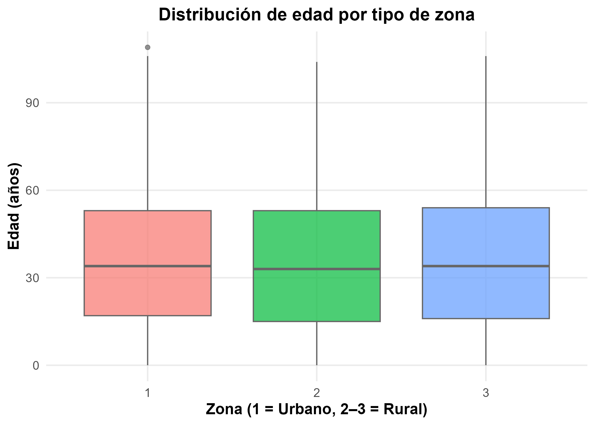
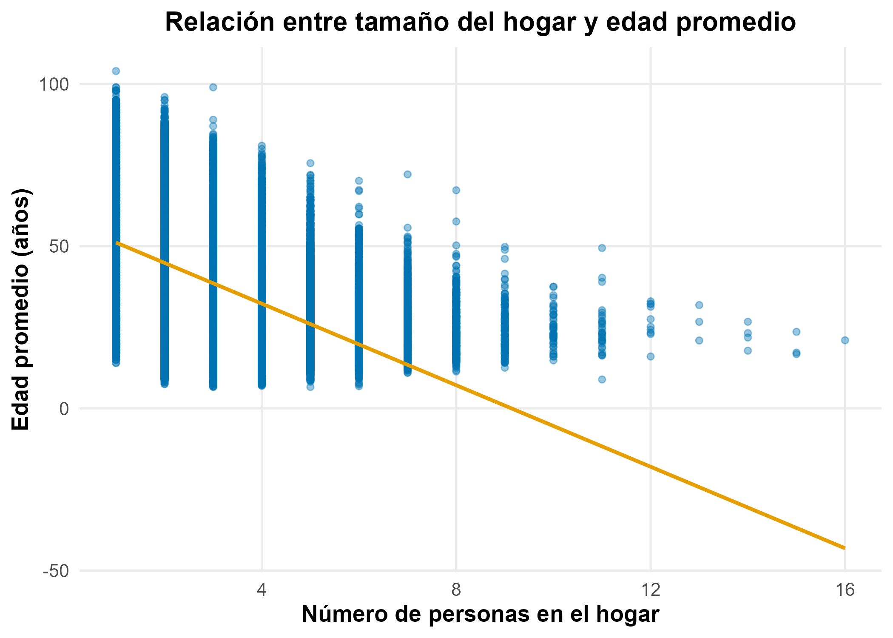
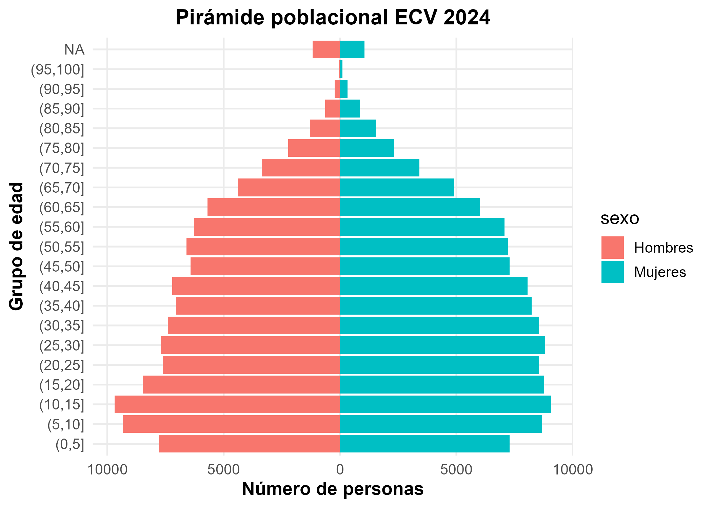
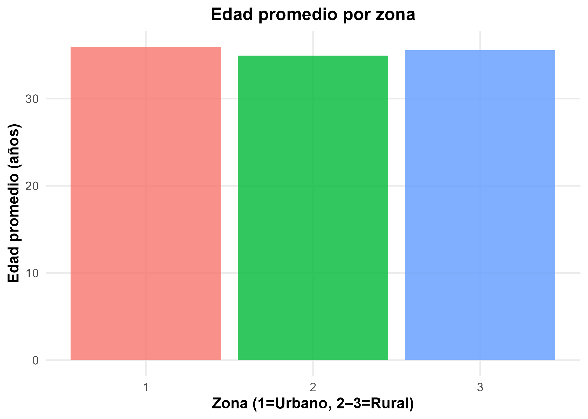
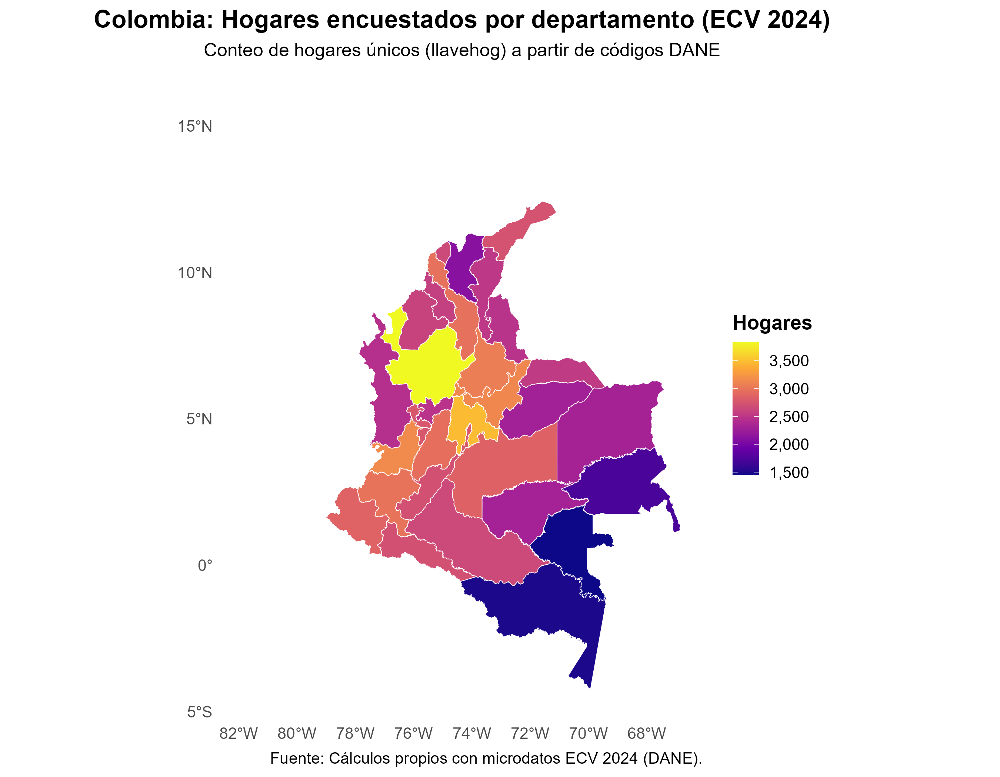

# 🧮 Análisis de la Encuesta de Calidad de Vida (ECV) 2024 — Limpieza, Visualización e Interpretación

**Autor:** Jhoan Sebastián Meza García  
**Proyecto:** *Estudio IPM 2024 – Universidad Nacional de Colombia*  
**Fecha:** Octubre de 2025  

---

## 📘 Descripción general

Este repositorio contiene el proceso completo de **construcción, limpieza y análisis descriptivo** de los microdatos de la **Encuesta Nacional de Calidad de Vida (ECV) 2024**, siguiendo la estructura oficial del DANE.

El objetivo principal fue **consolidar la base `base_final`**, depurada y lista para la estimación de los **15 indicadores del Índice de Pobreza Multidimensional (IPM)**, y desarrollar un conjunto de **visualizaciones exploratorias** que permitan entender las características demográficas y territoriales de la población encuestada.

---

## ⚙️ Estructura del proyecto

| Archivo | Descripción |
|----------|--------------|
| `Limpieza de datos.R` | Script principal de limpieza, unión y depuración de las tres bases del DANE: Viviendas, Hogares y Personas. |
| `visualizaciones_encuentas.R` | Script que genera las figuras descriptivas en formato PNG y guarda los resultados en alta resolución (300 dpi). |
| `01_edad.png` | Distribución de la edad. |
| `02_sexo.png` | Distribución por sexo. |
| `03_zona.png` | Distribución por tipo de área (urbano/rural). |
| `04_tamano_hogar.png` | Tamaño de los hogares. |
| `05_edad_zona.png` | Distribución de edad por área. |
| `06_edad_box.png` | Boxplot de edad por área. |
| `07_tamano_vs_edad.png` | Relación entre tamaño del hogar y edad promedio. |
| `08_piramide.png` | Pirámide poblacional. |
| `09_edad_media_zona.png` | Edad promedio por zona. |
| `mapa_hogares_por_departamento.png` | Mapa de hogares encuestados por departamento (Colombia). |

---

## 🧩 Metodología de limpieza

El script `Limpieza de datos.R` realiza los siguientes pasos:

1. **Carga de insumos**  
   Se importan los archivos CSV correspondientes a los módulos:
   - Viviendas  
   - Hogares  
   - Personas  
   
   Estos provienen de la estructura departamental de la ECV 2024.

2. **Creación de llaves únicas**  
   Se generan los identificadores:
   - `llavehog = DIRECTORIO + SECUENCIA_ENCUESTA`  
   - `llave_persona = DIRECTORIO + SECUENCIA_ENCUESTA + ORDEN`  

3. **Integración jerárquica**
   - Se unen los módulos respetando la relación:  
     **Vivienda → Hogar → Persona**  
   - Se conservan las variables relevantes (educación, salud, vivienda, ingreso, trabajo, entre otras).

4. **Depuración y control de duplicados**  
   Se eliminan duplicados a nivel persona (`DIRECTORIO`, `SECUENCIA_ENCUESTA`, `ORDEN`) garantizando una sola observación por individuo.

5. **Validación final**  
   Se revisan:
   - Número de personas y hogares.  
   - Existencia de variables clave (`P6040`, `P6020`, `CLASE`, `FEX_C`, `DEPARTAMENTO`).  
   - Integridad de los pesos expandibles (`FEX_C`).

---

## 📊 Visualizaciones descriptivas

El script `visualizaciones_encuentas.R` genera las siguientes figuras:

### 1️⃣ Distribución de la edad

**Interpretación:**  
La pirámide etaria presenta un perfil joven-adulto, con mayor concentración en los rangos de 15 a 40 años, lo cual es coherente con la estructura demográfica nacional.

---

### 2️⃣ Distribución por sexo

**Interpretación:**  
La composición por sexo es equilibrada, con una ligera predominancia femenina, consistente con las tendencias históricas de la población colombiana.

---

### 3️⃣ Distribución por zona

**Interpretación:**  
Cerca del 60 % de las personas encuestadas residen en **cabeceras urbanas**, mientras que las zonas **rurales dispersas** representan una proporción significativa, reflejando la importancia de incluir ambas áreas para el análisis del IPM.

---

### 4️⃣ Tamaño de los hogares

**Interpretación:**  
Predominan los hogares de **3 a 4 personas**, con una media de 3,7 individuos. La dispersión hacia hogares grandes (6 o más miembros) es menor pero no despreciable, especialmente en zonas rurales.

---

### 5️⃣ Distribución de edad por zona

**Interpretación:**  
Las áreas **rurales** concentran mayor proporción de población joven e infantil, mientras que las **urbanas** muestran una distribución más homogénea con leve envejecimiento demográfico.

---

### 6️⃣ Boxplot de edad por área

**Interpretación:**  
Las medianas de edad son similares, aunque el rango intercuartílico es mayor en zonas rurales, evidenciando más variabilidad etaria en esos contextos.

---

### 7️⃣ Tamaño del hogar vs edad promedio

**Interpretación:**  
Existe una **relación inversa**: los hogares más numerosos tienden a tener edades promedio más bajas, lo que sugiere estructuras familiares más jóvenes o con presencia infantil.

---

### 8️⃣ Pirámide poblacional

**Interpretación:**  
La base ancha confirma la predominancia de cohortes jóvenes, con estrechamiento progresivo hacia edades mayores.  
El equilibrio entre hombres y mujeres se mantiene hasta los 50 años, donde aumenta la participación femenina.

---

### 9️⃣ Edad promedio por área

**Interpretación:**  
El promedio de edad es mayor en las cabeceras urbanas, reflejando los patrones migratorios hacia las ciudades y el envejecimiento diferencial urbano-rural.

---

### 🔟 Mapa de hogares encuestados por departamento

**Interpretación:**  
Los departamentos con mayor número de hogares encuestados son **Antioquia, Valle del Cauca, Bogotá y Cundinamarca**, lo cual coincide con su peso poblacional en el marco muestral nacional.

---

## 🧾 Resultados resumen

| Indicador | Valor |
|------------|-------|
| Personas en la base | **≈ 228.000** |
| Hogares únicos | **≈ 85.000** |
| Edad promedio | **≈ 33 años** |
| Edad mediana | **≈ 31 años** |
| Tamaño medio del hogar | **3,7 personas** |
| Porcentaje urbano | **≈ 60 %** |
| Porcentaje rural (centros poblados + resto) | **≈ 40 %** |

---

## 🧠 Conclusión

El análisis descriptivo de la **ECV 2024** permite identificar patrones clave de la estructura demográfica y territorial del país:

- El perfil poblacional sigue siendo joven, aunque con señales de envejecimiento en zonas urbanas.  
- La ruralidad mantiene estructuras familiares amplias y edades promedio menores.  
- Los patrones observados sirven como insumo fundamental para el cálculo del **Índice de Pobreza Multidimensional (IPM)** y para la evaluación de políticas públicas con enfoque territorial.

---

## 📂 Créditos y licenciamiento

**Autor:**  
Jhoan Sebastián Meza García  
*Universidad Nacional de Colombia – Facultad de Ciencias Económicas*

**Licencia:**  
Creative Commons Attribution 4.0 International (CC BY 4.0)

**Repositorio:**  
[github.com/jhoanmeza/ECV2024-IPM](https://github.com/jhoanmeza/ECV2024-IPM)

